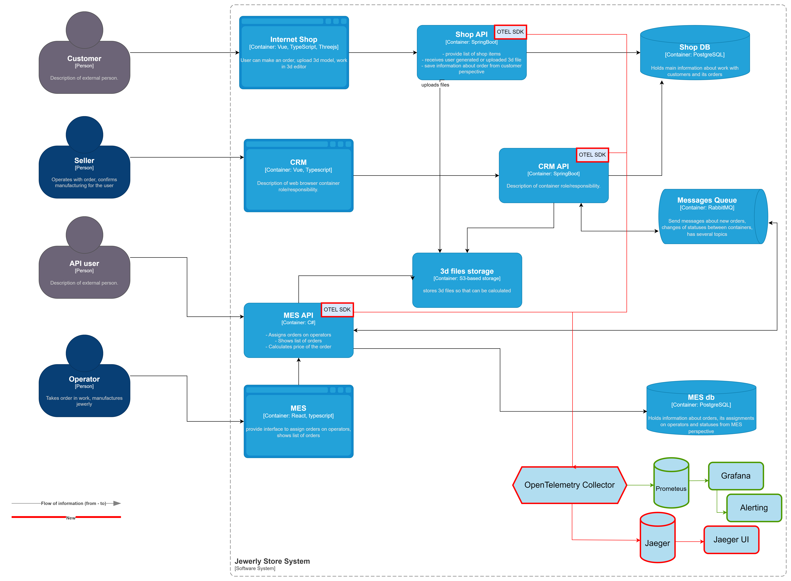

# Трейсинг

## Список сервисов для покрытия трейсами

* MES API 
* shop API
* CRM API

Данные в трейсах:

* информация о пользователе (user ID, роль)
* путь и входные параметры запроса
* исходный IP-адрес клиента
* состояние вызова (успешный или с ошибкой)
* информация об ошибках
* информация о зависимости (запросы к БД, очередям, внешним сервисам)
* таймауты в вызовах
* информация о синхронных запросах (путь и входные параметры запроса)

## Мотивация

Трейсинг обеспечит прозрачность выполнения запросов и взаимодействий между микросервисами. Это критически важно для распределенных систем.
Внедрив трейсинг, мы сможем:
 * при сбоях быстрее обнаруживать проблемы и собирать полные данные о контексте сбоя (какой запрос выполнялся, какие параметры использовались, что вернули связанные сервисы) 
 * иметь полное представление о цепочке вызовов, позволяя найти компоненты системы, которые вызывают сбои или задержки
 * оптимизировать медленные участки системы, потому что точно знаем, где теряем в производительности

**Метрики, которые улучшит внедрения трейсинга:**

Технические:

* время восстановления после сбоя
* производительность API
* время отклика системы
* количество ошибок и отказов
* надежность и доступность сервиса

Бизнес: 

* производительность команды разработчиков
* качество пользовательского опыта
* удовлетворенность клиентов

## Предлагаемое решение

Для трейсинга будем использовать следующие компоненты:

* `OpenTelemetry SDK` - для интеграции трейсинга в приложения
* `OpenTelemetryCollector` - для сбора, обработки и экспорта трейсов
* `Jaeger` - для хранения и обработки трейсов
* `Jaeger UI` - для детального анализа трейсов

Для мониторинга процесса прохождения заказов мы будем использовать данные трейсинга, которые будут собираться с shop API, CRM API, MES API.
Эти данные позволят отслеживать полный путь заказа, выявлять узкие места и проблемы на различных этапах, а также обеспечивать раннее обнаружение потенциальных сбоев.

Для мониторинга развернем следующие компоненты:
* `Prometheus` — для сбора и хранения метрик
* `Grafana` — для визуализации метрик и настройки алертов

Целевая схема решения:

## Компромиссы

Трейсинг, как и любая технология, имеет свои ограничения и затраты:

* длительное хранение трейсов может значительно увеличить расходы на хранение и обработку данных, поэтому мы будем ограничивать срок хранения трейсов
* для поддержания инфраструктуры трейсинга потребуется вовлечение ресурсов devops, что увеличит нагрузку на команду
* внедрение трейсинга потребует доработки существующих сервисов и обучения команды работе с новыми инструментами, что временно снизит производительность разработки

## Безопасность

* **Ограничение внешнего доступа**: доступ к компонентам, как Jaeger UI, будет ограничен только внутренними IP-адресами компании, с возможностью доступа через VPN или защищенную сеть. Внешний доступ будет полностью запрещён.
* **Аутентификация и авторизация**: доступ к данным о трейсах и их визуализации в Jaeger UI ограничим только сотрудниками компании. Для этого будет настроена аутентификация через корпоративную систему, а доступ будет регулироваться с помощью ролей и прав доступа
* **Аудит доступа**: будет настроено полное логирование всех операций, связанных с доступом к данным трейсов. Это позволит отслеживать действия пользователей и обнаруживать возможные попытки несанкционированного доступа
