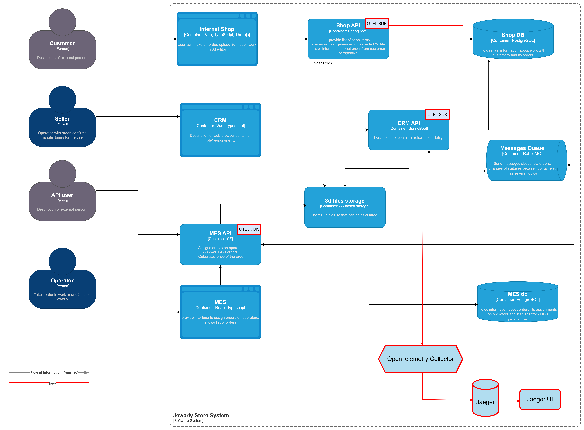

# Трейсинг

## Список сервисов для покрытия трейсами

* MES API 
* shop API
* CRM API

Данные в трейсах:

* информация о пользователе (user ID, роль)
* путь и входные параметры запроса
* исходный IP-адрес клиента
* состояние вызова (успешный или с ошибкой)
* информация об ошибках
* информация о зависимости (запросы к БД, очередям, внешним сервисам)
* таймауты в вызовах
* информация о синхронных запросах (путь и входные параметры запроса)

## Мотивация

Трейсинг обеспечит прозрачность выполнения запросов и взаимодействий между микросервисами. Это критически важно для распределенных систем.
Внедрив трейсинг, мы сможем:
 * при сбоях быстрее обнаруживать проблемы и собирать полные данные о контексте сбоя (какой запрос выполнялся, какие параметры использовались, что вернули связанные сервисы) 
 * иметь полное представление о цепочке вызовов, позволяя найти компоненты системы, которые вызывают сбои или задержки
 * оптимизировать медленные участки системы, потому что точно знаем, где теряем в производительности

Метрики, которые улучшит внедрения трейсинга:

Технические:

* время восстановления после сбоя
* производительность API
* время отклика системы
* количество ошибок и отказов
* надежность и доступность сервиса

Бизнес: 

* производительность команды разработчиков
* качество пользовательского опыта
* удовлетворенность клиентов

### Предлагаемое решение

Опишите, как и с помощью каких технологий будет реализован трейсинг, какие компоненты нужно внедрить или доработать. 
Отразите компоненты и новые связи на схеме. Скачайте диаграмму контейнеров Александрита» в модели C4. 
Доработайте диаграмму, исходя из вашего решения: отразите на ней новые компоненты и связи. 
Новые элементы выделяйте красным цветом — так ревьюеру будет проще проверить вашу работу. 
Когда схема будет готова, добавьте ссылку на неё в раздел «Предлагаемое решение».

Будем использовать:

* `OpenTelemetry SDK` - для интеграции трейсинга в приложения
* `OpenTelemetryCollector` - для сбора, обработки и экспорта трейсов
* `Jaeger` - для хранения и обработки трейсов
* `Jaeger UI` - для детального анализа трейсов

