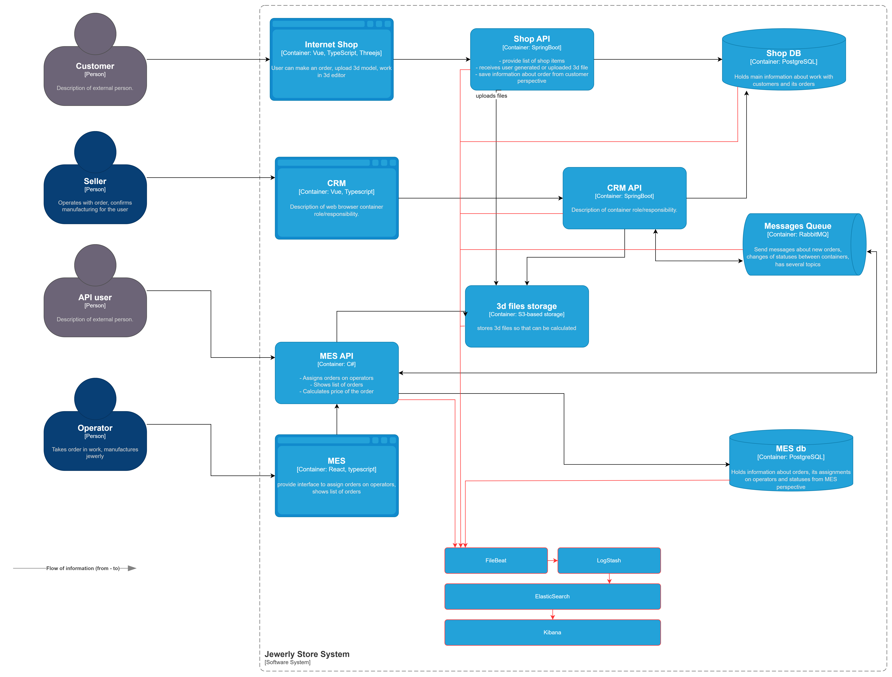

# Логирование

## Сбор логов: откуда собираем и что 

На схеме отображены системы, с которых требуется сбор логов:

* создание нового заказа (id, время, новый статус, пользователь, создавший заказ, детали заказа)
* изменение статуса заказа (id, время, новый статус)
* начало расчета стоимости (id заказа, время)
* окончание расчета стоимости (id заказа, время)
* обновление данных пользователя (id пользователя, время, измененные данные)
* поступление платежа (id транзакции, последние 4 цифры карты, способ оплаты, id заказа, время)
* ошибки при работе систем shop API, MES API, CRM API (время, текст ошибки, информация для локализации ошибки: stacktrace, имя класса и функции)

БД:
* ошибки (текст запроса, информация о пользователе, имя БД, текст ошибки)
* неудачные соединения (логин, имя БД, IP-адрес, время попытки)
* длительные запросы, превышающие установленный порог (текст запроса, информация о пользователе, имя БД, время выполнения)
* изменения структуры БД (время изменения, инициатор, тип изменения)

Message Broker:
* неуспешные попытки доставки сообщений (причина ошибки, идентификатор сообщения, имя очереди)
* изменения конфигурации очередей (тип изменения, время, инициатор, имя очереди)

Уровень DEBUG будем использовать в случаях, когда требуется подробный лог. Например, во время разработки или при отладке сложных и редких проблем на продакшене. 

## Мотивация

Логирование предоставляет подробную информацию о работе системы в реальном времени. Это базовый инструмент для диагностики, анализа и мониторинга, позволяющий получать информацию о состоянии системы, её компонентах и взаимодействиях.

Внедрив логирование, мы сможем:

* сделать систему стабильнее, анализируя логи и устраняя ошибки
* оперативно устранять сбои, фиксируя причины критических ошибок
* получать данные для аудита, включая изменения в заказах, платежах и конфигурациях
* анализировать поведение системы и выявлять узкие места
* быстро разбирать клиентские ошибки, используя данные логов для диагностики

## Предлагаемое решение

Для логирования будем использовать следующие компоненты:

* `Filebeat` - для сбора и передачи логов в Logstash или Elasticsearch
* `Logstash` - для фильтрации и обработки логов перед их отправкой в хранилище
* `Elasticsearch` - для хранения и индексирования логов
* `Kibana` - для визуализации и анализа логов

### Политика безопасности

* маскирование чувствительных данных: логи будут обрабатываться в Logstash для скрытия или удаления чувствительных данных, таких как персональная информация и номера карт.
* ограничение доступа к логам: доступ к логам получат только авторизованные сотрудники через ролевую модель Elasticsearch
* аудит доступа: все действия с логами фиксируются, алерты настроены на подозрительную активность
* изоляция сред: логи из production будут отделены от логов из dev- и test-сред для предотвращения утечек

## Политика хранения логов

* **индексация**: для каждой системы будут созданы отдельные индексы, чтобы упростить управление и поиск. Логи аудита будут выделены в специализированные индексы для дополнительной защиты и анализа
* **архивирование**: устаревшие логи будут перемещены в холодное хранилище (например, S3), что позволит снизить затраты и сохранить доступ к данным для редкого использования
* **сроки хранения**: логи production-систем будут храниться 30 дней, а логи аудита — до 90 дней, в зависимости от бизнес-требований
