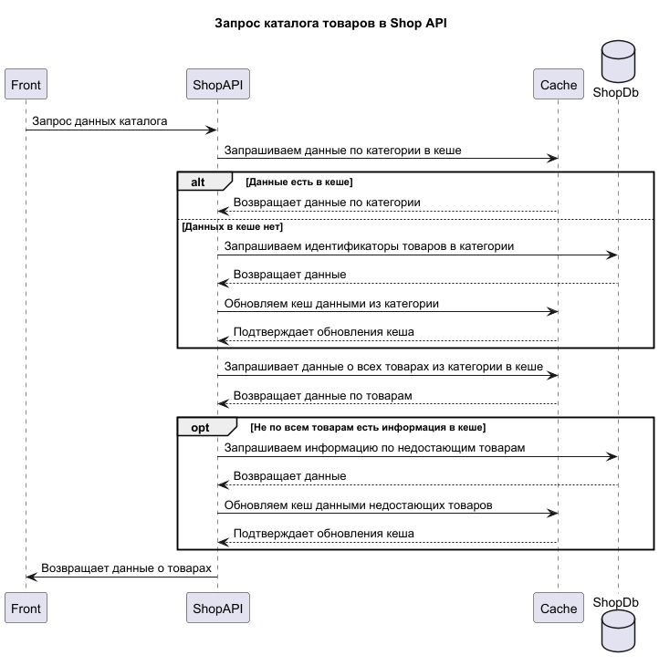

# Кеширование

## Мотивация

Внедрение кеширования необходимо для решения следующих проблем:

* **снижение нагрузки на БД**: уменьшение количества запросов к базам данных за счёт хранения часто запрашиваемых данных
* **ускорение отклика системы**: улучшение времени отклика API, особенно для пользователей во время пиковых нагрузок
* **повышение стабильности**: предотвращение сбоев и задержек в критических точках системы

**Ключевые точки для кеширования**:
* `Shop API`: кеширование каталога товаров для улучшения пользовательского опыта и быстрого доступа к данным
* `MES API`: кеширование данных о последних заказах для мгновенного предоставления информации операторам

## Предлагаемое решение

### Кеширование каталога товаров в shop API

Будем кешировать данные для самых популярных групп:
* товары на главной
* промо
* новинки
* sale
* товары популярных категорий
и т.д.

#### Подход к кешированию данных

Внедрим серверное кеширование:
* каталог товаров может быть большим и изменяться нечасто, сервер сможет централизованно управлять обновлением данных и их консистентностью
* разные клиенты могут использовать одну и ту же кешированную копию данных

#### Паттерн кеширования

В качестве паттерна кеширования будем использовать `Cache-Aside`: каталог данных очень часто читается и очень редко обновляется.




Для этого мы будем кешировать:

* саму группу для запроса будем кешировать в виде пары ключ=`key` (к примеру, `sale`, `category:{categoryId}`, `newarrivals` и т.д.) и массив идентификаторов товаров из этой группы
  Пример:
```json
{
  "sale": [101, 202, 303, 404, 505]
}
```
* товары будем кешировать парами ключа `product:{productId}` и его данными в виде json, и будем кешировать запросы:
```json
{
  "product:101": { "id": 101, "name": "Product 101", "price": 100 }
}
```

#### Анализ альтернативных подходов к кешированию
 
* `Write-Through` подходит для сценариев с частыми записями: в каталоге преобладают операции чтения
* `Refresh-Ahead` подходит для сценариев с большим количеством операций чтения, но так как каталог меняется так редко, мы получим обновления кеша без реальной необходимости.

#### Стратегия инвалидации кеша

Стратегия: Инвалидация по ключу

Доработаем систему так, при добавлении/изменении/удалении карточки товара или изменении наполнения товарами в категориях в каталоге в системе генерировались соответствующие события и складывались в Kafka. 
Создадим консьмюер, который будет реагировать на эти события и удалять кеш товара или категории, у которой были изменения.

Для возможности реагирования в случае внештатных ситуаций мы создадим endpoint, который полностью очистит кеш.

| Временная инвалидация                                                                                | Инвалидация, основанная на запросах                                                                 | Инвалидация на основе изменений                                                                                | Программная инвалидация                                                                                        | Инвалидация по ключу                                                                                      |
|------------------------------------------------------------------------------------------------------|-----------------------------------------------------------------------------------------------------|----------------------------------------------------------------------------------------------------------------|----------------------------------------------------------------------------------------------------------------|-----------------------------------------------------------------------------------------------------------|
| Неоптимальна: из-за редких изменений большинство обновлений кеша будет происходить без необходимости | Не подходит, потому что мы кешируем определенные категории и не кешируем узкие запросы пользователя | По сути это и выбираем, но так как инвалидируем данные точечно, а не целиком, то выбираем инвалидацию по ключу | Можно использовать, но в нашем случае простые условия инвалидации не требуют сложных программных подходов | Оптимальна: изменения в каталоге редки и мы можем инвалидировать точечно товары и категории с изменениями |


### Кеширование данных о последних заказах в MES API

Будем кешировать данные о последних 100 заказах: операторы часто смотрят именно первые страницы, чтобы поскорее взять в работу новые заказы.
Важно, чтобы операторы видели самые актуальные данные, чтобы минимизировать ситуации, когда оператор выбирает заказ, который уже в работе другого оператора.

#### Подход к кешированию данных

Внедрим серверное кеширование:
* мы сможем реагировать на изменения в заказах и держать кеш актуальным
* разные операторы могут использовать одну и ту же кешированную копию данных

#### Паттерн кеширования

В качестве паттерна кеширования будем использовать `Write-Behind`: мы будем кешировать только результаты расчетов за последние 4 часа. 

#### Анализ альтернативных подходов к кешированию

* `Write-Through` подходит для сценариев с частыми записями: в каталоге преобладают операции чтения
* `Refresh-Ahead` подходит для сценариев с большим количеством операций чтения, но так как каталог меняется так редко, мы получим обновления кеша без реальной необходимости.

#### Запрос товаров из каталога


#### Стратегия инвалидации кеша

Стратегия: Инвалидация по ключу

Доработаем систему так, при добавлении/изменении/удалении карточки товара в каталоге в системе генерировались соответствующие события и складывались в Kafka.
Создадим консьмюер, который будет реагировать на эти события и актуализировать кеш каталога.

Для каких-то внештатных ситуаций, когда нужно срочно полностью перезаполнить каталог, мы создадим endpoint, который очистит кеш, чтобы он наполнился заново при следующем запросе к каталогу.

| Временная инвалидация                                                                                | Инвалидация, основанная на запросах              | Инвалидация на основе изменений                                                                              | Программная инвалидация                                                                                        | Инвалидация по ключу                                                                                                                 |
|------------------------------------------------------------------------------------------------------|--------------------------------------------------|--------------------------------------------------------------------------------------------------------------|----------------------------------------------------------------------------------------------------------------|--------------------------------------------------------------------------------------------------------------------------------------|
| Неоптимальна: из-за редких изменений большинство обновлений кеша будет происходить без необходимости | Не подходит, потому что мы кешируем весь каталог| Неоптимально: из-за точечных изменений нет смысла полностью обновлять кеш каталога при каждом изменении | Можно использовать, но в нашем случае простые условия инвалидации не требуют сложных программных подходов | Оптимальна: изменения в каталоге редки и можно обновлять только изменённые или добавленные товары, избегая лишних операций |


